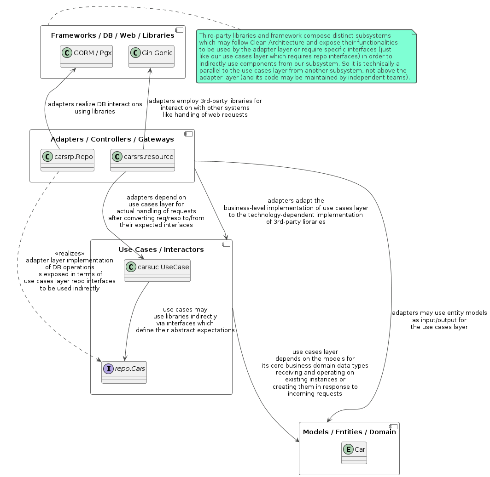

# Clean Architecture

[](https://goreportcard.com/report/github.com/momeni/clean-arch)
[](https://pkg.go.dev/github.com/momeni/clean-arch)
[](https://github.com/momeni/clean-arch/releases/latest)
[](http://mozilla.org/MPL/2.0/)

This project demonstrates an example Go (Golang) realization of
the _Clean Architecture_ using the [Gin Gonic](https://gin-gonic.com/docs/)
web framework. The [GORM](https://gorm.io/docs/) library and a
[PostgreSQL](https://www.postgresql.org/docs/current/) DBMS are used for
data persistence and [podman](https://github.com/containers/podman) based
testing codes are provided too.

Four main layers are seen as depicted in the following component diagram.
These layers are usually drawn as
[co-centered](https://miro.medium.com/v2/resize:fit:1280/1*yTDpfIqqAdeKRhbHwfhrYQ.png)
[circles](https://miro.medium.com/v2/resize:fit:3136/1*43uKsXfq35PrJKJTBq1MJw.png).
The inner-most layer is the **Entities** layer which is also known as
the *Models* or *Domain* layer. This layer contains the entity types
which are defined in the business domain and may be used by a high-level
implementation of interesting use cases, without technology-specific
implementation details. These models are expected to have the least
foreseeable changes since their changes are likely to propagate to
other layers. As an example entity in this project, we can mention the
[model.Car](pkg/core/model/car.go) type.
These models may be used by both of the **Use Cases** and **Adapters**
layers. The standard language libraries are treated similarly too.

The **Use Cases** or **Use Case Interactors** layer contains the core
business logic of a system. This code may use the defined models for
different purposes such as data passing, requests/responses formatting,
or data persistence. This layer can be seen as a facade for the entire
system too as it defines the acceptable public use cases of a system.
The high-level implementation of this layer makes it relatively stable
as it only depends on the domain entities and does not need to change
whenever a third-party library is updated or when a new technology is
supposed to be adapted. As an example type from this layer, take a
look at the [carsuc.UseCase](pkg/core/usecase/carsuc/carsuc.go) type.



A concrete method is required in order to wire up the use cases of a
system to the use cases of other systems, allowing them to interact
based on their expected and exposed public interfaces.
For example, a web framework such as [Gin Gonic](https://gin-gonic.com/docs/)
requires a series of [HandlerFunc](https://pkg.go.dev/github.com/gin-gonic/gin#HandlerFunc)
functions in order to call them when a web request is recevied which
may be different from how they are managed in [Echo](https://echo.labstack.com/docs/request).
Conversely, use cases require to employ functionalities of an ORM like
the [GORM](https://gorm.io/docs/) in order to store or search among
models, having a database management system server.
The **Adapters** layer which is also know as *Controllers* or *Gateways*
is responsible to fill these gaps without making the frameworks and
third-party libraries on one hand and the use case interactors on the
other hand dependent on each other.
The use cases layer contains [repo.Cars](pkg/core/repo/carsrp.go) example
interface in order to show its expectations from a cars repository. This
interface is realized by [carsrp.Repo](pkg/adapter/db/postgres/carsrp/repo.go)
from the adapters layer, where it uses [GORM](https://gorm.io/docs/) and
[Pgx](https://github.com/jackc/pgx) libraries for interaction with a
[PostgreSQL](https://www.postgresql.org/docs/current/) DBMS server.
The adapters layer depends on both of our high-level logics and other
libraries provided/required interfaces in order to adapt them together.
To be precise, the *Controllers* is not a suitable alias for this layer
because adapters should be thin and focus on converting interfaces or
simple serialization/deserialization tasks, while the use cases layer
contains the more complex business-level flow controls.
Parsing configuration such as [config.Config](pkg/adapter/config/config.go)
and instantiating components from other layers during the system startup
are also a part of this layer.

The outmost layer contains **Frameworks** and *Libraries* which are
usually implemented independent of the main project. Their codes are
also independent of our system and may change from time to time, or we
may need to replace them with alternatives as new technologies are
introduced. Because it is desired to keep our codes immune to changes
in the APIs of those libraries, adapters layer has to hide their details
by realizing the use cases layers interfaces and implementing any
missing functionality or mismatched expectations.
Indeed, these frameworks are parallels to our use cases layer, but in
their own project.

## Configuration File and Settings

System use cases may be configured using a series of settings. For this
purpose, each use case accepts its required and optional settings as a
series of positional arguments and functional options.
All configuration settings may be kept in a configuration file, so
system can start up by parsing that file and instantiating the relevant
use case objects.
A subset of those settings may be mutable which their storage in the
database allows users to change them dynamically without editing the
deployment-time configuration file (holding the default settings).
Another subset of settings may be visible which remote users, using
the system exposed APIs, are allowed to observe them.
Of course the sets of mutable and visible settings may have an
intersection. And there may be settings which are mutable, but invisible
(write-only) or visible, but immutable (read-only).
These categories of settings can be represented using three structs.

  1. A main Settings struct which has fields for mutable settings,
  2. A Visible settings struct which is embedded by Settings and
     represents fields which are mutable and also visible,
  3. An Immutable settings struct which is embedded by Visible and
     represents fields which are visible, but immutable.

When accepting user inputs, we can take a Settings struct and then
set the Immutable member to nil in order to retrieve all mutable
settings (whether they are or are not visible).
When reporting them back to user, we can take a Visible struct which
excludes invisible fields (containing mutable and immutable visible
settings).
Since these types are sent to or retrieved from users and processed in
the use cases layer, they need a representation in the models layer.
Also, they need a configuration-file format specific representation
because they should be serialized and stored in the configuration file
and database. For simplicity, we can assume that settings which are
stored in a configuration file and a database, both follow a common
configuration version.

## Versioning and Migration

As user requirements evolve, software products need to be changed so
they can address the updated requirements. Ideally, changes are limited
to one file or package and their side-effects can be restricted easily.
However, in practice changes may propagate across packages and modules
and reach to other components. In order to manage these changes, it is
required to detect them and all components which may be affected by them
so their required changes may be planned whenever their dependencies are
supposed to be updated.

[Semantic versioning](https://semver.org/spec/v2.0.0.html) helps with
detection of changes and their possible effects on their client codes.
A software may expose multiple APIs and each API will require its own
semantic version, so it may be tracked by its clients. In Golang, each
module may be imported by other modules. Hence, the Golang code itself
acts as an API and needs a version. This version is the most volatile
one. That is, if there is another exposed API such as a REST API, all
changes in those APIs (and a new released version of those APIs) cause
a new released version of the Golang module too. A semantic version has
three components, namely major.minor.patch (followed by pre-release
identifier and version components if any).

  1. A patch version update indicates internal implementation changes
     with no visible effect in the public API, hence, clients do not
     need to be changed,
  2. A minor version update indicates addition of new features which
     may be used by updated clients, however, old clients can keep
     running with no updates (of course, using the old features and
     ignoring the new features),
  3. A major version update indicates addition of backward-incompatible
     changes, so clients have to be updated in order to keep working.

Another aspect which benefits from semantic versioning is the data
requirements of a software, including its configuration files and
database schema. Versioning config files and database schema separately
allows a robust migration scheme to be provisioned, simplifying the
software upgrade and downgrade workflows in the production environment.

Three migration actions may be used based on the deployment mode.
First two actions (i.e., `init-dev` and `init-prod`) initialize the
database with development or production suitable data records. The
expected version of the database schema is read from the config file.
The third action, takes a source and destination configuration file
paths, connects to the database which is described by the source config,
reads its data records, converts them properly, and stores them in the
database which is described by the destination config. The config file
contents are migrated too, so the same configuration settings which were
specified by the source config are depicted using the destination config
version's format. The migrated config file will be saved in the main
path of the config file (first two actions only used this main config
path because they were not supposed to generate a new config file).

```bash
./caweb db init-dev [-c /path/of/main/config.yaml]
./caweb db init-prod [-c /path/of/main/config.yaml]
./caweb db migrate /path/of/src/config.yaml /path/of/dst/config.yaml \
        [-c /path/of/main/config.yaml]
```

All three actions also renew the destination database credentials
for the admin and normal roles (except in the special case that a
multi-database migration has been asked, but the source and destination
databases are the same and so it is impossible to change the destination
database without updating the source database too, so the passwords of
the admin and normal roles are not renewed too; indeed, those roles
do not have a leaked value in this scenario like the fresh databases
and their renewal is not a security requirement).
A multi-database migration consists of the following main steps:

  1. The src config file is read in order to obtain the src config and
     database versions and build src migrator objects (this may require
     to connect to the src database and load parts of the settings from
     a table, if settings may be overridden),
       - settings which are read from the src database follow the same
         version which is used for the src config file and so they can
         be combined easily,
       - if settings had a different version and so they could not be
         loaded, but the src and dst databases were the same too (not
         just their versions, but the actual host, port, and database
         name, so we are going to skip the database migration part as
         mentioned in step 4 below), we should check for two factors.
         First, whether the `/path/of/main/config.yaml.migrated` file
         exists and points to the src and dst equivalent databases at
         hand. Second, whether the settings which were read from the
         database follow the same format which is asked by the dst
         config file (considering its major version alone, since minor
         and patch versions should be set to the latest supported values
         in that major version and not exactly equal with the asked
         values). These two factors indicate that we had skipped the
         database migration in step 4 previously, saved the expected
         configuration file in step 8, updated the src/dst database
         there in order to hold the new mutable settings (with the dst
         config file format) and finally committed those changes in
         step 9, before the previous migration attempt could fail.
         In this scenario, the old migration attempt may be resumed
         by jumping to step 11,
  2. The dst config file is read in order to obtain the dst config and
     database versions and build dst migrator objects (the dst database
     is supposed to be empty, hence, it may not override the config file
     settings),
  3. Migrate the src configuration settings up or down, so they are
     represented by the config file format which is asked by the dst
     config file, computing new settings based on the previous settings,
     and if there are new settings which may not be computed by old
     settings, fill them based on the default values which are read from
     the dst config file (the result is kept in memory as the new main
     configuration settings),
  4. If the src and dst databases are the same (not just their versions,
     but the actual host, port, and database name, so it is impossible
     to keep src immutable while writing to dst), skip the database
     migration part and jump to step 8,
  5. Find the sequence of database version migration steps and their
     corresponding schema names (each schema should be created in the
     dst database during the next step),
       - First schema is used to import the contents of the src database
         as a Foreign Data Wrapper (FDW) in the dst database and is
         named after the major and minor version of the src database
         like `fdw1_0`,
       - Second and latter schema (but the last one) are used to keep
         the intermediate states and are named after the major version
         of the schema versions which will be met in the migration path
         including the major version of the src and dst versions too
         like `mig1`, `mig2`, and `mig3` where each schema must contain
         the schema of that major version with its latest known minor
         version,
       - Last schema represents the target persistent schema and is
         named after the major version like `caweb3`,
  6. Using the admin user of the dst database, create the `postgres_fdw`
     extension (if it is not already created), drop all relevant schema
     in the reverse order of step 5 (see sub-items), drop the relevant
     foreign server and its user mapping (if any), create the normal
     user if it is missing, create all required schema (as identified by
     and in the same order which is specified by step 5), grant their
     complete privileges to the normal user in addition to the USAGE
     privilege of the `postgres_fdw` extension, and finally renew the
     admin and normal user roles passwords.
     Thereafter, using the normal user of the dst database, create a
     foreign server in order to represent the src database, create user
     mapping so the normal user from the dst database may connect to
     the src database as its normal user, and import FDW schema,
       - Before creating each schema, it is required to ensure that
         either that schema did not exist or was empty (so an already
         poppulated database is not overwritten),
       - For this purpose, the old schema must be dropped (ignoring its
         absence error) without cascading (so it must be empty to be
         dropped) before trying to create it,
       - Start dropping and then creating the empty schema (and foreign
         server and so on) in the reversed order, dropping the last
         schema (e.g., `caweb3` in above example) first and moving
         backwards so in case of failure, it can be determined that the
         ultimate schema is already poppulated or some intermediate
         schema can not be dropped,
       - If any schema cannot be dropped, but the ultimate one, it is
         a fatal error and migration may not continue automatically,
           * Stop the migration in this scenario,
       - If the ultimate schema cannot be dropped, check for existence
         of the `/path/of/main/config.yaml.migrated` file and whether
         it points to the dst database at hand in order to detect an
         old migration attempt which was terminated after completion of
         the step 9 (since before that step, database contents are not
         committed and only empty schema are created),
           * Jump to step 10 in this scenario,
       - Atomically update the admin and normal roles password values
         in the dst database,
           * Generate new passwords and write them in a temp file like
             the .pgpass.new file,
           * Alter both passwords in a transaction,
           * Move the new passwords file over the old one,
           * In case of resumption, try both passwords files in order to
             find which one works correctly, remove the other file and
             move the correct file so .pgpass file works, then continue
             with generation of a new .pgpass.new file and so on,
  7. Using the normal user, connect to the dst database and perform the
     database migration in one transaction (this step finishes while the
     transaction is still open and ready to be committed),
  8. Save the obtained configuration settings (from step 3) in the main
     config file with a distinct extension so it may be moved over the
     main config file later with an atomic file system level operation,
     for example, writing in `/path/of/main/config.yaml.migrated` file,
       - If the database migration part was bypassed, the dst database
         version must be kept as claimed in the src and dst config files
         (which of course must be the same),
       - In absence of the database migration part, configuration file
         format may change and so the settings format which should be
         stored in the database may change, therefore, a transaction
         must begin on the dst database (which is the src database too)
         and mutable settings with the target version should be stored
         in that transaction,
       - If the migration part was executed, the dst config file claimed
         version for the target database may be used only for the major
         version determination, while the minor and patch versions must
         be taken based on the latest known numbers (which of course
         must be equal or more recent than the dst config file value),
       - In presence of the database migration part, it is required to
         also serialize the mutable settings (with their target format)
         and store them in the dst database, in the same transaction
         which was used for creation and filling of other tables so far,
  9. Commit the dst database changes (which may persist created tables
     if the database migration was not bypassed in step 4 or may only
     persist the updated mutable settings in the src/dst database),
  10. Using the admin user, drop all extra schema (but the `caweb3` in
     the above example) with cascade (if they exist and database
     migration part was not skipped),
  11. Move `/path/of/main/config.yaml.migrated` file (from step 8) to
     the main config file (e.g., `/path/of/main/config.yaml`).

Aforementioned algorithm needs a method for migrating a configuration
file and also a database schema to one step up or down. When starting
from a minor version which is not the last known minor version (in a
given major version), for example, starting by v1.1 while v1.5 is also
supported, it must be migrated up to v1.5 which is its lastet known
minor version. No downward migration is defined in this case because
we can stop with a more recent minor version and be assured that the
older code (which had asked for an older minor version) will not notice
the presence of new features.
At the latest minor version of each major version, it is possible to
migrate to the next or previous major version (again to its latest
known minor and patch versions).
For example, if asked to migrate from v1.1 to v3.2, we may traverse this
path: `v1.1 (schema fdw1.1)`, `v1.5 (schema mig1)`, `v2.8 (schema mig2)`
and then `v3.5 (schema mig3)` which are transient and finally to the
`v3.5 (schema caweb3)` which is the ultimate persistent schema. In this
case, the v3.5.2 may be written in the main config file instead of the
asked `v3.2.0` too.
In contrary to the ultimate schema which needs to use created tables,
the intermediate schema may use views in order to avoid copying data
items and just encode the required conversion rules in the database.

In the same way that configuration and database contents could be
migrated, a project may require to migrate some data items which are
stored in the file system too. By the way, in such cases, special care
is required in order to entangle the entire migration process to the
database transaction (as seen in the aforementioned step 9).
Nevertheless, these repeatability and idempotency features are only
useful for attended upgrades. If an unattended upgrade is desired,
a lower-level approach is necessary with file system or lower level
snapshots, otherwise a system which fails (e.g., due to power outage)
in the middle of an upgrade process may even fail to boot up again.

## Read More

For further reading, you may check

  * Martin, R. C., Grenning J., & Brown S. (2017). [Clean architecture](https://plefebvre91.github.io/resources/clean-architecture.pdf).
  * Lano, K., & Yassipour Tehrani, S. (2023). [Introduction to Clean Architecture Concepts](https://link.springer.com/chapter/10.1007/978-3-031-44143-1_2). In Introduction to Software Architecture: Innovative Design using Clean Architecture and Model-Driven Engineering (pp. 35-49). Cham: Springer Nature Switzerland.
